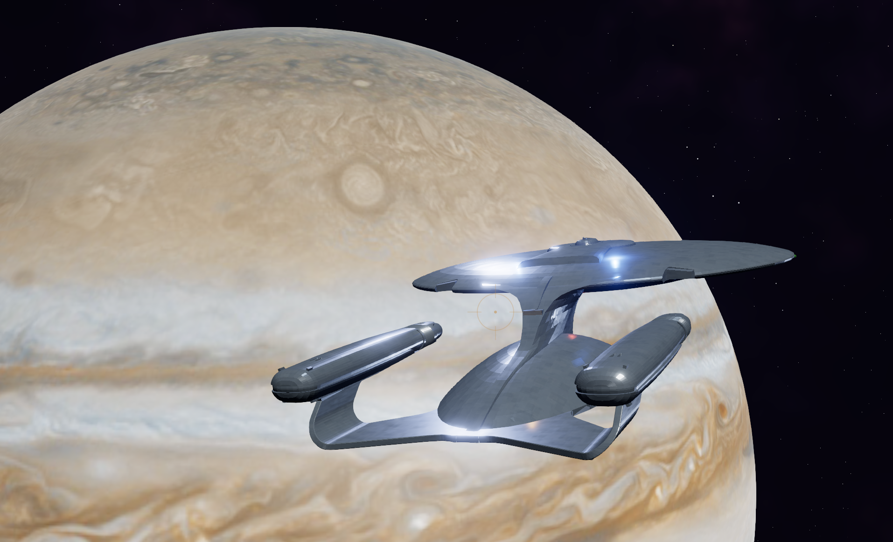
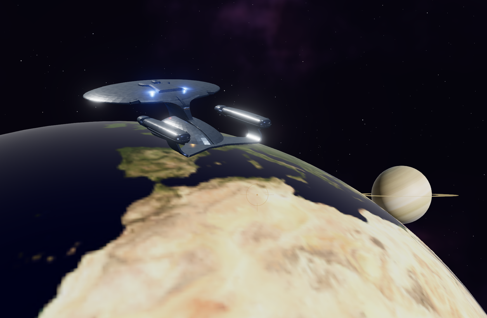
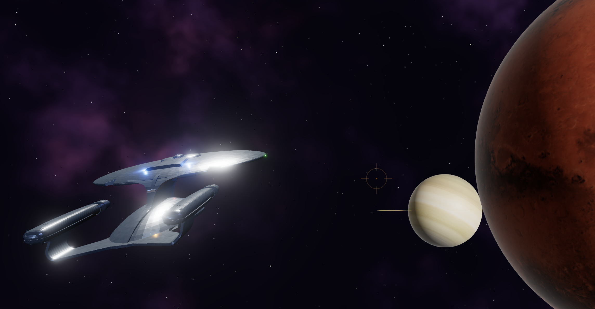
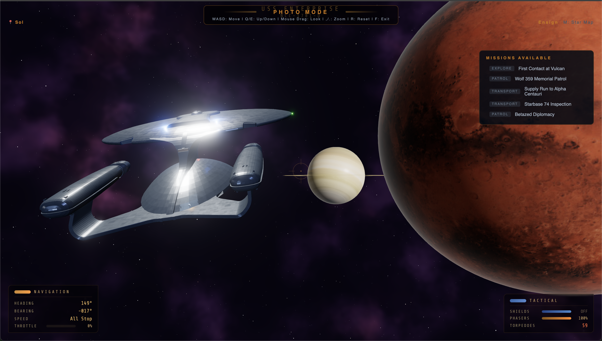

# Star Trek Enterprise — Browser Game

Command the USS Enterprise NCC-1701-D in a fully browser-based 3D space game built with Vue 3, Three.js, and TypeScript.









## Controls

| Key | Action |
|-----|--------|
| W / S | Pitch up / down |
| A / D | Yaw left / right |
| Q / E | Roll |
| 0–9 | Set speed |
| CapsLock | Toggle warp |
| Space | Fire phasers |
| T | Fire torpedo |
| X | Toggle shields |
| M | Star map |
| F | Photo mode |

## Run

```bash
npm install
npm run dev
```

Go to [localhost:5173](http://localhost:5173) to play the game.